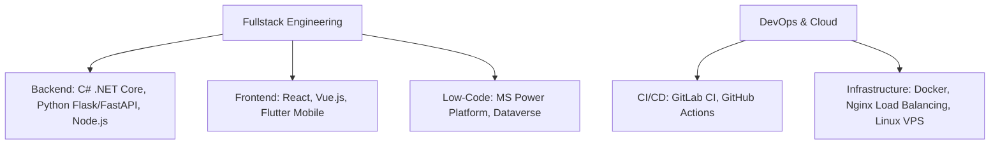

# Hi there, I'm Phú Nguyễn (phunhph) 👋
### Software Engineer | Fullstack & DevOps Developer | Solution Architect

A versatile and results-driven Software Engineer with **~2 years of hands-on experience** architecting and building robust backend systems, scalable web applications, and automated enterprise workflows. Specializing in **Python (FastAPI, Flask)**, **.NET ecosystem (C# ASP.NET Core)**, and **DevOps & Infrastructure automation**.

Certified **Microsoft Power Platform Developer (PL-400)**, passionate about bridge integrations between custom web systems and low-code ecosystems, high-concurrency systems design, and AI-driven workflow optimization.

---

### 🚀 About Me

- 🔭 **Current Position:** Backend & DevOps Specialist at **HBLAB Joint Stock Company**.
- 🧠 **Research & Specialized Fields:** Agentic AI Systems, LLM Orchestration, Dynamic Agentic Neural Networks (DANN), and high-performance server/AI computing workstations.
- 🎓 **Education:** Graduated top-tier in Website Programming from **FPT Polytechnic College** (GPA: 3.8/4.0), 2nd Prize in the FPT Self-Driving Car Competition.
- ⚡ **Fun Fact:** Love building custom high-performance server hardware and tuning Linux kernels for heavy AI/ML compute workloads.

---

### 🛠️ Core Expertise & Tech Stack

| Category | Technologies |
| :--- | :--- |
| **Languages** |      |
| **Backend & Frameworks** |      |
| **Frontend & Mobile** |     |
| **Low-Code & Enterprise** |   `Dataverse` `Custom Connectors` `C# Plugins` |
| **Databases & Storage** |     `SQLAlchemy` |
| **DevOps & Cloud** |      |

---

### 💼 Professional Experience Highlights

#### **HBLAB Joint Stock Company** *(Fullstack & DevOps Developer | 05/2025 - Present)*
*   **MIESArchitectX:** Engineered RESTful APIs in C# .NET Core and optimized SQL Server database schema (LINQ query optimization & migration). Configured multi-stage deployment environments (Dev/Staging/Prod).
*   **CRM Internal:** Developed custom .NET C# API connectors and Dataverse plugins. Automated internal sales pipelines using model-driven/canvas Power Apps and Power Automate, boosting workflow efficiency by 40%.

#### **247 Technical** *(Junior Fullstack & DevOps | 05/2024 - 05/2025)*
*   **Menas HR System:** Engineered secure Flask-based Python REST APIs with strict JWT access control to process sensitive payroll/employee data, integrated with a responsive Flutter mobile frontend.
*   **CI/CD Automation:** Built automated GitLab CI pipeline suites, successfully cutting down manual release overhead by 80%. Managed VPS deployments with Docker, Docker Compose, Nginx, and SSL/TLS.

#### **Freelance Projects** *(Fullstack Developer & Architect | 09/2023 - 05/2025)*
*   **AI-Driven Systems:** Built NLP-driven resume-career matching engines and concurrent PDF text analysis services using FastAPI, Pandas, and Scikit-learn.
*   **High-Traffic Infrastructure:** Upgraded a legacy Laravel/Express exam platform, set up Nginx Load Balancing to handle peak examinee traffic, and built a stream-based data migration pipeline from AWS S3 to Google Drive API (slashed storage costs by 50%).

---

### 📊 GitHub Stats & Metrics

  
  

---

### 📫 Connect with Me

  
  
  

